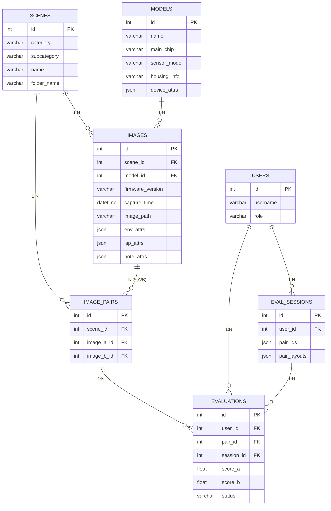

## 1. 系统总体概述

本系统旨在为图像评测团队提供一个专业、规范的盲评平台，核心解决海量异构图像元数据的管理、多机型同场景的横向盲评对比、以及多维度评测结果的计算与展示问题。

系统设计遵循以下核心原则：

- **极简实用（YAGNI）**：不预先设计当前不需要的表和逻辑，7张核心表覆盖所有业务。
- **核心与扩展分离**：高频筛选字段固定列+索引，低频动态扩展字段使用JSON列。
- **盲评隔离**：机型信息在服务端组装时隔离，前端仅接收无标识的左右图URL。
- **预生成持久化**：图像配对预生成并持久化，避免运行时计算爆炸。

### 1.1 全局 ER 图

## 2. 图像管理模块

本模块负责图像资源的分类、入库、存储与配对，是盲评系统的数据基座。

### 2.1 场景管理

- **场景层级定义**：场景由 `大类(地点)` × `子类(时段)` 二维组合而成（如：城市道路×白天 = 城市道路-白天）。
- **排行榜粒度支持**：通过 `category` 和 `subcategory` 独立索引，支持按大类汇总得分和按具体场景筛选得分。
- **动态扩展**：管理员可随时新增大类（如“停车场”）或子类（如“清晨”），系统自动拼接场景全名。

### 2.2 机型管理

- **身份与参数统一**：机型表（`models`）统一维护机型身份及静态硬件参数。
- **高频筛选固化**：主控型号、Sensor型号、焦距、分辨率、壳体信息提取为固定列并建立索引，保障排行榜多维度筛选性能。
- **低频扩展JSON**：镜头型号、光圈、白光灯珠料号等低频/易变参数存入 `device_attrs` JSON列。

### 2.3 图像采集与录入

- **一场景一机型一图约束**：同一场景下同一机型只保留一张当前有效的图像（`UNIQUE(scene_id, model_id)`）。
- **固件版本归属**：固件版本属于采集记录（放于 `images` 表），而非机型。固件升级时采用**覆盖机制**（旧图及旧评分作废）。
- **环境属性剥离**：天气、光照等环境属性属于每次采集独有，存入 `images.env_attrs`，而非场景表。
- **动态元数据JSON化**：环境属性、ISP参数、备注分三个JSON列存储，应对需求方后续字段扩展，避免DDL操作。

### 2.4 图像配对管理

- **手动触发**：配对不由系统实时生成，而是由管理员在确认某场景图像录入完毕后手动点击触发。
- **同场景全组合**：基于 `C(n,2)` 算法，将同一场景下不同机型的图像两两配对并持久化到 `image_pairs`。
- **增量配对**：新增机型图像后再次触发配对，系统仅增量插入新的配对，不破坏已有配对和评分。

## 3. 用户管理模块

本模块负责系统用户的身份认证与权限控制，采用轻量级设计。

### 3.1 角色与权限

- **Admin（管理员）**：拥有场景/机型/图像的录入权限，配对触发权限，以及查看非盲数据（机型信息）的权限。
- **Evaluator（评测员）**：仅能参与盲评打分，无法获知图像对应的机型信息。
- **Guest（访客）**：仅可查看脱敏后的排行榜结果（预留）。

### 3.2 会话与认证

- **无状态JWT**：采用JWT进行接口鉴权，不在数据库层维护Session表，降低复杂度。
- **评测状态绑定**：用户当前评测进度通过 `eval_sessions` 表追踪，记录活跃状态与最后活跃时间。

## 4. 盲评任务管理模块

本模块是系统的状态机核心，控制评测的分配、展示、评分流转。

### 4.1 评测会话管理

- **批次分配**：评测员发起评测时，系统从待评测图池中按规则抽取一批 `pair_ids`，生成一个评测会话（`eval_sessions`）。
- **断点续评**：会话状态分为 `active` 和 `completed`。中途中断再次登录，系统恢复活跃会话，继续未完成的图对。
- **进度追踪**：会话记录总配对数与已完成数，计算实时进度。

### 4.2 盲评匿名机制

- **服务端随机化**：分配图对时，服务端生成 `pair_layouts` JSON，随机决定 A/B 图在左右的展示位置，彻底切断"左侧偏好"带来的数据偏差。
- **前端隔离**：前端渲染时仅接收 `left_image_url` 和 `right_image_url`，不携带任何 `model_id` 或 `model_name`。

### 4.3 评分状态机

- **双态管理**：评分记录仅存在 `draft`（草稿/进行中）和 `submitted`（已提交）两种状态。
- **防重复提交**：通过 `UNIQUE(user_id, pair_id)` 约束，保证同一评测员对同一图对仅有一次最终评分。

## 5. 盲评结果清洗、计算模块

本模块负责将原始打分转化为可信的量化指标，当前采用轻量级逻辑，不搞沉重的规则引擎。

### 5.1 异常评分过滤

- **时间异常**：过滤浏览时间极短（如 < 2秒）的评分，视为未认真查看。
- **偏好异常**：检测并标记连续多次选择同一侧的评测员数据。
- **标记而非删除**：异常数据不做物理删除，仅在计算时剔除，保留追溯能力。

### 5.2 一致性验证

- **个体一致性**：对同一场景下的相似图对，评测员的打分趋势是否一致。
- **组间一致性**：多名评测员对同一图对的评分方差是否在合理范围内。
- **实时计算**：当前数据规模下，一致性指标在查询时实时计算聚合，无需物化中间表。

### 5.3 得分计算

- **聚合算法**：机型得分采用中位数（MEDIAN）而非平均数，抵抗极端值干扰。
- **多层级聚合**：支持按具体场景计算得分，以及按大类合并计算综合得分。

## 6. 盲评结果展示模块

本模块面向管理员和评测员提供数据可视化和洞察。

### 6.1 多维度排行榜

- **筛选维度**：支持按场景大类、具体场景、主控型号、Sensor型号、焦距、分辨率、壳体信息进行筛选和交叉筛选。
- **固件版本区分**：支持查看不同固件版本对得分的影响。
- **实时查询**：当前规模（15场景×4机型=90对）直接通过SQL多表JOIN实时计算毫秒级返回，无需物化宽表。

### 6.2 评测数据追溯

- **图对回放**：管理员可查看任意图对的所有评测员打分分布、耗时、左右选择详情。
- **数据导出**：支持将原始评分数据和排行榜计算结果导出为CSV/Excel，供外部深度分析。