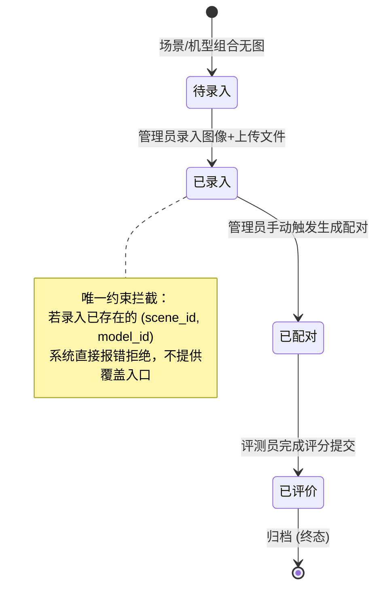
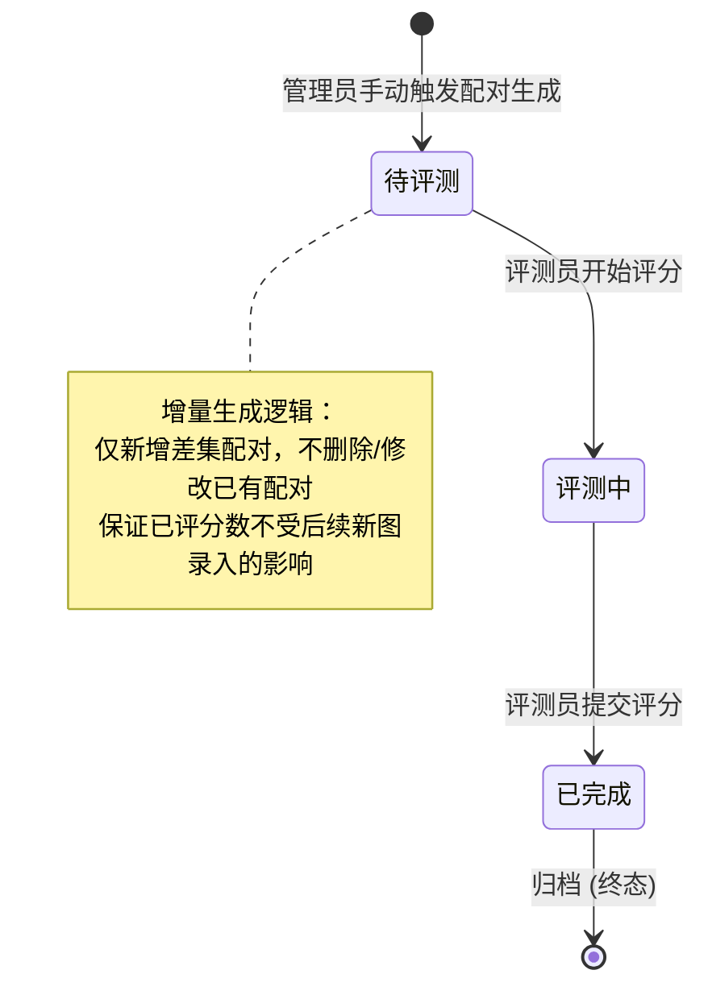
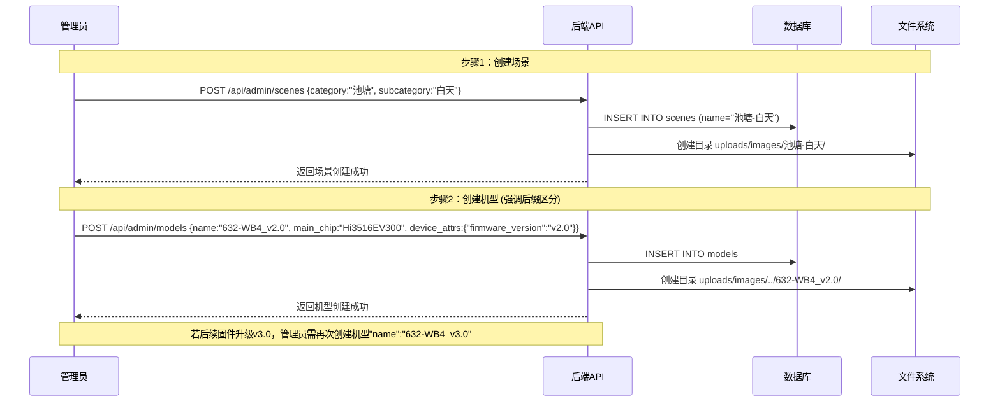
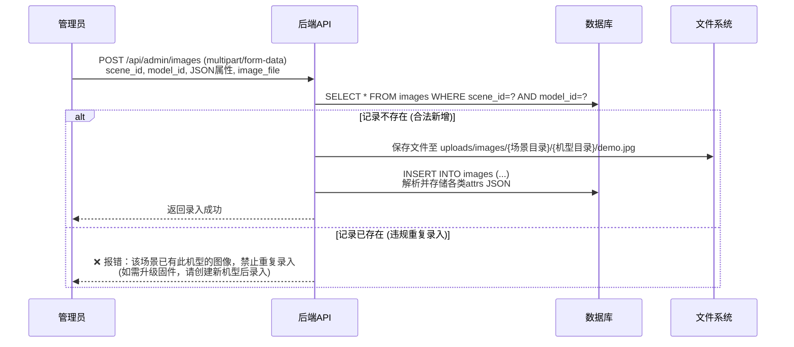
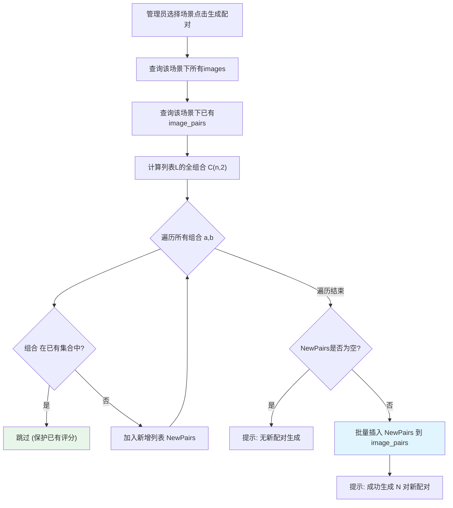

## 1. 模块内部实体模型

本模块涉及4张核心数据表，遵循"固定列保性能，JSON保扩展"的混合模型设计。

### 1.1 场景分类表 (scenes)

只存分类信息，环境属性在 images 中。

| 字段名         | 类型              | 说明                |
| ----------- | --------------- | ----------------- |
| id          | INT PK          | 主键                |
| category    | VARCHAR(50)     | 大类（如：城市道路、池塘）     |
| subcategory | VARCHAR(50)     | 子类/时段（如：白天、傍晚、夜晚） |
| name        | VARCHAR(100) UK | 场景全名=大类-子类（自动拼接）  |
| folder_name | VARCHAR(200) UK | 存储目录名             |
| sort_order  | INT             | 排序权重              |

### 1.2 机型表(models)

机型身份

| 字段名          | 类型              | 说明                                    |
| ------------ | --------------- | ------------------------------------- |
| id           | INT PK          | 主键                                    |
| name         | VARCHAR(100) UK | 机型名称=采集设备名（**需含版本后缀，如 632-WB4_v2.0**) |
| folder_name  | VARCHAR(200) UK | 存储目录名                                 |
| main_chip    | VARCHAR(100)    | 主控型号（高频筛选■）                           |
| lens_model   | VARCHAR(100)    | 镜头型号（高频筛选■）                           |
| sensor_model | VARCHAR(100)    | Sensor型号（高频筛选■）                       |
| focal_length | VARCHAR(50)     | 焦距（高频筛选■）                             |
| resolution   | VARCHAR(50)     | 分辨率（高频筛选■）                            |
| housing_info | VARCHAR(100)    | 壳体信息（高频筛选■）                           |
| device_attrs | JSON            | 低频扩展参数（固件版本/光圈/帧率/场景模式等）              |
| features     | TEXT            | 机型特点（排行榜展示用）                          |

### 1.3 图像记录表

图像元数据表，每张图一条记录。`model_attrs` 作为拍摄时刻的参数快照。

| 字段名         | 类型                         | 说明                             |
| ----------- | -------------------------- | ------------------------------ |
| id          | INT PK                     | 主键                             |
| scene_id    | INT FK                     | 所属场景                           |
| model_id    | INT FK                     | 所属机型                           |
| image_path  | VARCHAR(500)               | 图像文件相对路径                       |
| model_attrs | JSON                       | 采集设备属性（设备名/主控型号/镜头型号/焦距等，支持扩展） |
| env_attrs   | JSON                       | 场景环境属性（天气/光照/色温/照度等，支持扩展）      |
| isp_attrs   | JSON                       | ISP参数（增益/曝光/白平衡等，支持扩展）         |
| note_attrs  | JSON                       | 备注信息（人员/时间/地点/目的/特殊说明等，支持扩展）   |
| **约束**      | UNIQUE(scene_id, model_id) | **同一场景同一机型仅一张图**               |

### 1.4 图像对表 (image_pairs)

预生成持久化配对，盲评最小单元。

| 字段名        | 类型                             | 说明     |
| ---------- | ------------------------------ | ------ |
| id         | INT PK                         | 主键     |
| scene_id   | INT FK                         | 所属场景   |
| image_a_id | INT FK                         | 图像A    |
| image_b_id | INT FK                         | 图像B    |
| sort_order | INT                            | 排序权重   |
| **约束**     | UNIQUE(image_a_id, image_b_id) | 防止重复配对 |

## 2. 模块内部状态机

### 2.1 图像记录生命周期

图像记录由于存在"一场景一机型一图"的强约束，其生命周期主要围绕"新增"与"覆盖（固件升级）"展开。



### 2.2 图像对生命周期


## 3. 模块内部交互逻辑

### 3.1 场景与机型创建流程

场景和机型作为系统的基础字典，必须由管理员预先创建，避免测试人员录入时因命名不规范产生脏数据。
针对“软件版本视作不同机型”的原则，管理员在创建机型时需遵循严格的命名规范。


### 3.2 图像录入与上传流程

录入时，前端通过下拉框绑定已有的 `scene_id` 和 `model_id`，并上传图像及填写记录表数据。
录入时，若触发 `UNIQUE(scene_id, model_id)` 约束，直接视为重复数据错误，不提供覆盖机制。



### 3.3 管理员手动配对流程

当某个场景下的图像录入完毕后（或新增了某机型图像后），管理员手动触发配对生成。



**增量配对逻辑说明**：  
假设场景下已有机型 A, B, C，配对为 (A,B), (A,C), (B,C)。  
现新增机型 D 的图像并再次触发配对：

1. 查出当前图像：A, B, C, D
2. 查出已有配对：(A,B), (A,C), (B,C)
3. 计算全组合：(A,B), (A,C), (A,D), (B,C), (B,D), (C,D)
4. 过滤差集，仅新增：(A,D), (B,D), (C,D)
5. 旧配对及旧评分完全不受影响。

## 4. 完整录入流程实例 (以 aaa.jpg 为例)

现有一张 `aaa.jpg` 及其对应的环境采集表，完整走通代码实现流程。

### 4.1 模拟采集表数据

```
# 场景：池塘白天
# 机型：632-WB4 v1.0

# 一、基础采集信息
- 采集时间：2026/05/10/14/30/00
- 采集人员：李四
- 采集地点：光明池塘
- 采集环境：室外
- 设备编号：IPC_02
- 采集目的：盲评
- 特殊说明：无

# 二、场景信息
- 点位类型：河流森林-池塘
- 天气：晴天
- 季节：夏
- 时段：白天
- 照明模式：自然光
- 光照类型：均匀光 - 顺光 - 正常光
- 目标类型：其他
- 环境色温：6500K
- 样机计算色温：6800
- 环境照度：45000
- 运动状态：静止
- 关系描述：水面反光测试

# 三、图像/视频参数
- 设备名：632-WB4 1.0
- 主控型号：Hi3516EV300
- 镜头型号：LS-2812
- 焦距：2.8mm
- 光圈：f/1.2
- Sensor型号：IMX307
- 白光灯珠料号：LED-W-03
- 分辨率：1920×1080
- 采集帧率：25fps
- 固件版本：v2.0
- 壳体信息：SH-632-A
- 场景模式：通用模式

# 四、ISP参数
- Sensor Analog Gain：1.0
- Sensor Digital Gain：1.0
- Total Gain：1.0
- 曝光时间：0.033
- 白平衡 RGain：1.05
```
### 4.2 步骤1：前置创建 (若系统尚无相关字典)

**创建场景**

```
POST /api/admin/scenes
Content-Type: application/json

{
  "category": "池塘",
  "subcategory": "白天"
}
```

**创建机型（注意命名规则与固件版本存放）**

```
POST /api/admin/models
Content-Type: application/json

{
  "name": "632-WB4 v1.0", 
  "main_chip": "Hi3516EV300",
  "lens_model": "LS-2812",
  "sensor_model": "IMX307",
  "focal_length": "2.8mm",
  "resolution": "1920×1080",
  "housing_info": "SH-632-A",
  "device_attrs": {
    "firmware_version": "v2.0",
    "aperture": "f/1.2",
    "led_part_no": "LED-W-03",
    "frame_rate": "25fps",
    "scene_mode": "通用模式"
  }
}
```

### 4.3 步骤2：图像及元数据录入

前端将采集表数据解析并与图片一起提交。

```
POST /api/admin/images
Content-Type: multipart/form-data

// 1. 关联ID（前端通过下拉框获取）
scene_id: 1   // 池塘-白天
model_id: 1   // 632-WB4 v1.0

// 2. 图像文件
image_file: (binary, aaa.jpg)

// 3. 机型快照属性 (采集表第三部分，固件版本需包含在内)
model_attrs: '{
  "device_name": "632-WB4 1.0",
  "main_chip": "Hi3516EV300",
  "lens_model": "LS-2812",
  "focal_length": "2.8mm",
  "aperture": "f/1.2",
  "sensor_model": "IMX307",
  "led_part_no": "LED-W-03",
  "resolution": "1920×1080",
  "frame_rate": "25fps",
  "firmware_version": "v2.0",
  "housing_info": "SH-632-A",
  "scene_mode": "通用模式"
}'

// 4. 场景环境属性 (采集表第二部分)
env_attrs: '{
  "point_type": "河流森林-池塘",
  "weather": "晴天",
  "season": "夏",
  "time_period": "白天",
  "lighting_mode": "自然光",
  "lighting_type": "均匀光 - 顺光 - 正常光",
  "target_type": "其他",
  "env_color_temp": "6500K",
  "device_color_temp": 6800,
  "env_illuminance": 45000,
  "motion_state": "静止",
  "relation_desc": "水面反光测试"
}'

// 5. ISP参数 (采集表第四部分)
isp_attrs: '{
  "sensor_analog_gain": 1.0,
  "sensor_digital_gain": 1.0,
  "total_gain": 1.0,
  "exposure_time": 0.033,
  "wb_r_gain": 1.05
}'

// 6. 备注信息 (采集表第一部分)
note_attrs: '{
  "capture_time": "2026/05/10/14/30/00",
  "capture_person": "李四",
  "capture_location": "光明池塘",
  "capture_env": "室外",
  "device_code": "IPC_02",
  "capture_purpose": "盲评",
  "special_note": "无"
}'
```