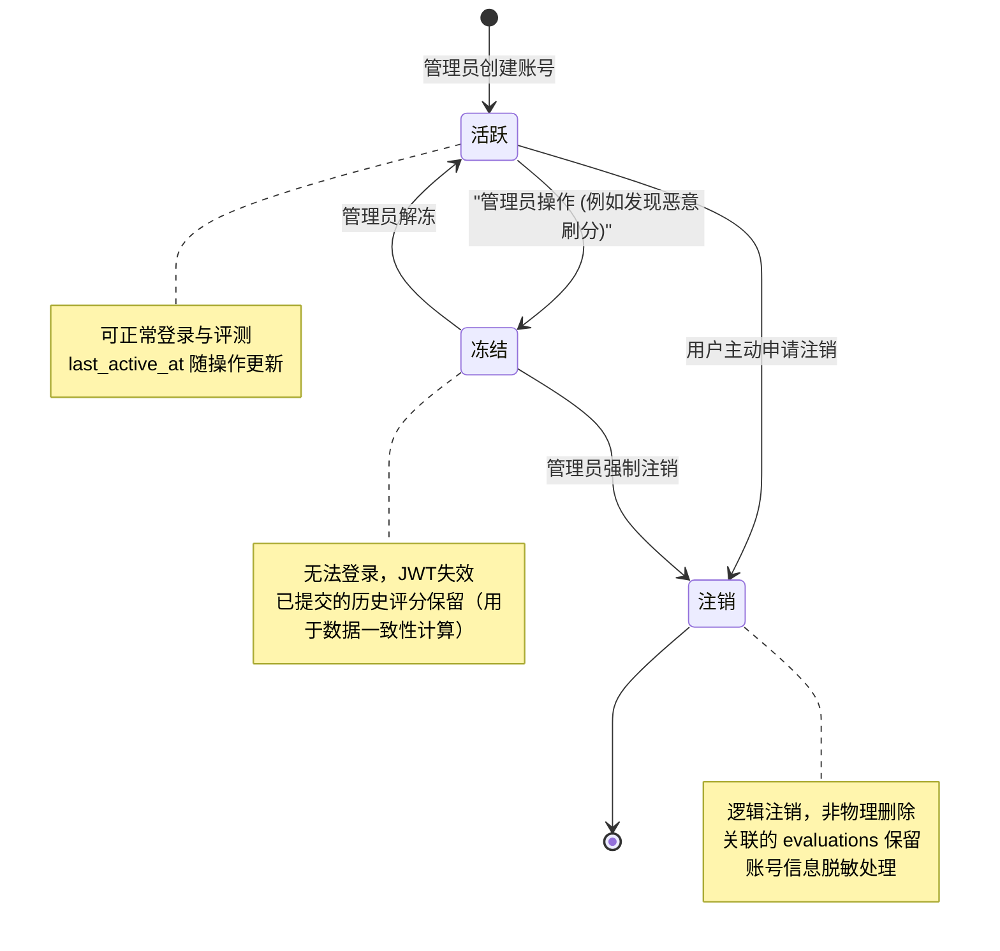
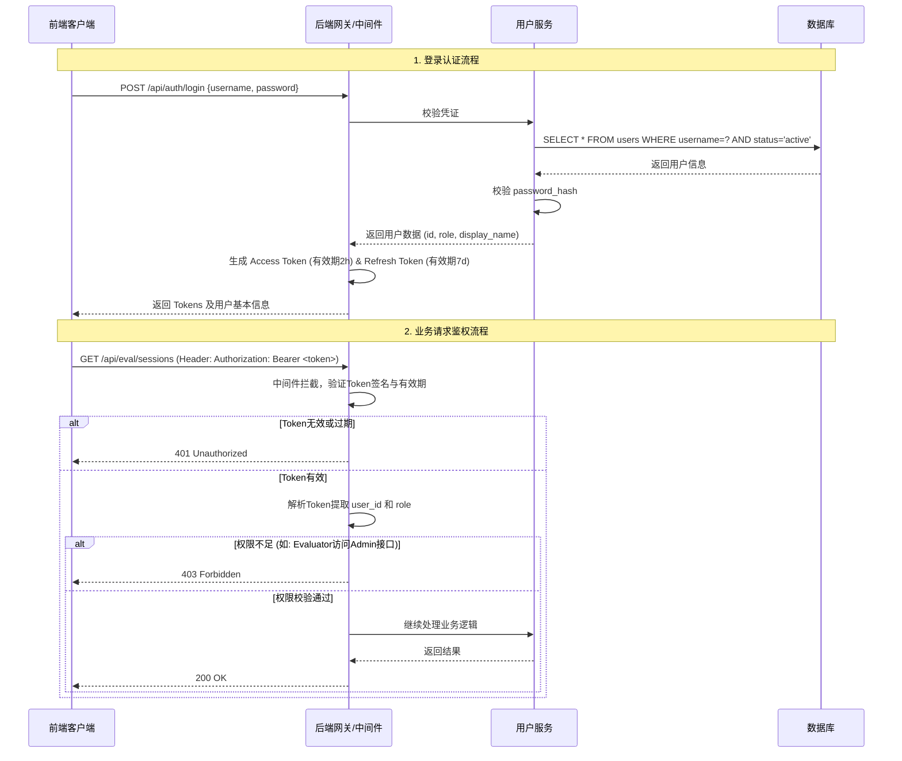

## 1. 模块内部实体模型

本模块的核心实体为用户表（`users`），采用轻量级设计，结合无状态JWT令牌管理认证，不在数据库层维护Session信息。

### 1.1 用户表

| 字段名            | 类型           | 约束                            | 说明                                              |
| -------------- | ------------ | ----------------------------- | ----------------------------------------------- |
| id             | INT          | PK, AUTO_INCREMENT            | 主键                                              |
| username       | VARCHAR(50)  | UNIQUE, NOT NULL              | 登录用户名                                           |
| email          | VARCHAR(120) | UNIQUE, NOT NULL              | 邮箱（用于通知）                                        |
| password_hash  | VARCHAR(255) | NOT NULL                      | Argon2/bcrypt 加密后的密码哈希                          |
| role           | ENUM         | NOT NULL, DEFAULT ‘evaluator’ | 角色：`admin`(管理员), `evaluator`(评测员), `guest`(访客)  |
| display_name   | VARCHAR(100) | DEFAULT ‘’                    | 显示名称（前端展示用）                                     |
| status         | ENUM         | NOT NULL, DEFAULT ‘active’    | 账号状态：`active`(活跃), `frozen`(冻结), `inactive`(注销) |
| last_active_at | DATETIME     | NULL                          | 最后活跃时间（用于统计与清理）                                 |
| created_at     | DATETIME     | DEFAULT CURRENT_TIMESTAMP     | 创建时间                                            |

### 1.2 角色权限矩阵

|功能模块|操作|Admin (管理员)|Evaluator (评测员)|Guest (访客)|
|---|---|---|---|---|
|**图像管理**|场景/机型/图像的增删改|✅|❌|❌|
||触发图像配对|✅|❌|❌|
||查看图像元数据及机型绑定|✅|❌|❌|
|**盲评任务**|发起/继续评测会话|✅|✅|❌|
||提交评分|✅|✅|❌|
|**结果展示**|查看脱敏排行榜|✅|✅|✅|
||查看评分明细及机型对应关系|✅|❌|❌|

## 2. 模块内部的状态机

用户账号状态管理遵循极简原则，保证业务安全的同时降低维护复杂度。

### 2.1 用户账号生命周期

## 3. 模块内部的交互逻辑

### 3.1 认证与授权流程 (JWT无状态方案)

系统采用JWT（JSON Web Token）进行接口鉴权，避免在数据库中维护Session表，降低服务端状态同步压力。

### 3.2 评测员断点恢复逻辑

用户登录后，系统需自动检测其是否有未完成的评测会话，实现断点续评。
